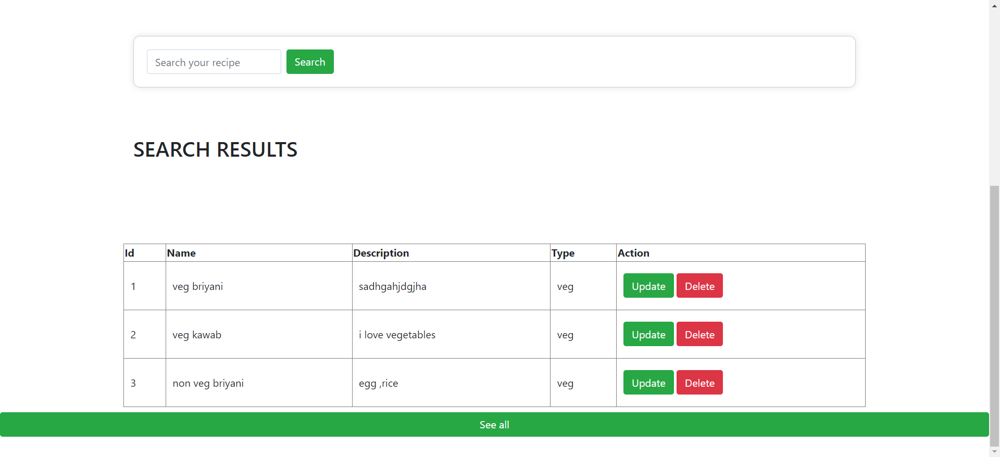
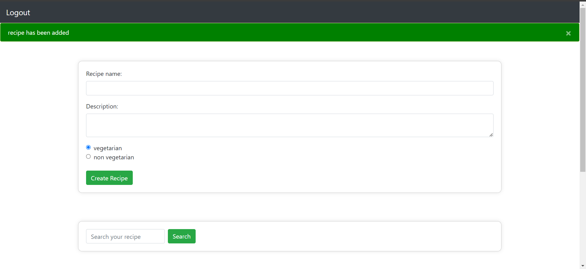
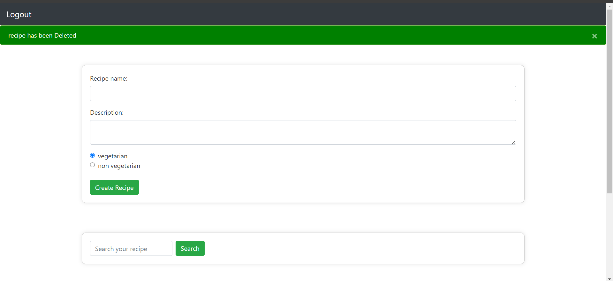

This is a python and django project, with HTML and CSS for front end.

here is a signup/register page:

this is a signin page:
you can only signin if you are registered,

signin page will authenticate if you are registered or not and give you alert accordingly,
if you are registered but you have entered wrong password then also you will goind to get a amessage

this is a main/home page :

here is form to insert/add new recipe:

here are function like searching you recipe by its name also it has update and delete recipe options respectively,

if you perform search operation ,this is the wy you will going to get the result,

this message you will get if you add any recipe and will see your new recipe in your table on the same page,

this message you will get if you delete any recipe,

if you choose to update the recipe then you will get a new page update recipe page,

